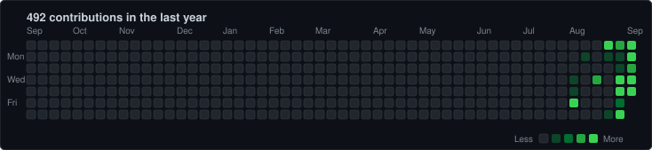

UI/UX designer who likes designing websites and digital products, experimenting with ideas, and giving them just enough engineering to make them real.

---

### stuff i use
- python, html, css, javascript
- photoshop, illustrator, figma
- firebase

---

### projects
- **[playstation store ui](https://byanam.github.io/PlayStation-Store-UI/)** — landing page for the playstation store, thought id give it a go  
  [live demo](https://byanam.github.io/PlayStation-Store-UI/) · [github repo](https://github.com/byanam/PlayStation-Store-UI)
- **[notes 101](https://notes--101.web.app)** — another note taking app, yeaah ik ik, not the most original idea but mine looks like an IDE + Photoshop cause why not   
  [live demo](https://notes--101.web.app) · [github repo](https://github.com/byanam/notes101)

---

### streak

  

